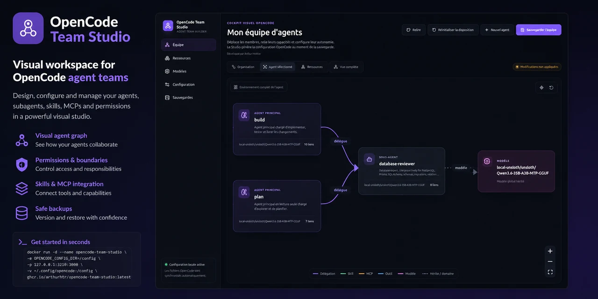

<p align="center">  </p>

# OpenCode Team Studio

A visual workspace for designing, configuring, and managing OpenCode agent teams.

---

OpenCode Team Studio is an independent community project. It is not built, maintained, endorsed, or officially affiliated with the OpenCode team.

---

[](https://github.com/ArthurHtr/opencode-team-studio/actions/workflows/ci.yml)
[](https://github.com/ArthurHtr/opencode-team-studio/actions/workflows/codeql.yml)
[](https://github.com/ArthurHtr/opencode-team-studio/pkgs/container/opencode-team-studio)
[](https://github.com/ArthurHtr/opencode-team-studio/releases)
[](./LICENSE)
[](#status)

## Demo

<!-- TODO: Add screenshot and GIF once available -->
<!-- See `docs/GITHUB_SETUP_CHECKLIST.md` for the asset production checklist. -->

The Studio provides an interactive graph workspace where you can:

- Visualize your entire OpenCode agent team as a node graph
- Inspect individual agents, their prompts, permissions, and model settings
- Configure skills, MCP servers, and tool access
- Edit the global OpenCode configuration with preserved formatting

## Problem

OpenCode configurations grow complex quickly. As the number of agents, skills, MCP servers, tools, models, and permissions increases, understanding the full picture through raw JSON or YAML files becomes difficult.

OpenCode Team Studio provides a visual interface layered on top of your existing OpenCode configuration files. It reads and writes the same files OpenCode uses, preserving comments, unknown properties, and formatting.

## Features

- **Visual agent graph** — Interactive React Flow canvas showing agents, skills, MCP servers, tools, and models
- **Primary agents and subagents** — Manage agent hierarchy and delegation relationships
- **Task delegation links** — Configure `permission.task` relations through the graph
- **Skills and MCP assignment** — Assign skills and MCP servers to agents visually
- **Model configuration** — Configure providers, models, variants, temperature, and top-p
- **Permission editor** — Fine-grained `allow`, `ask`, `deny` rules with inheritance
- **OpenCode configuration preservation** — Comments, unknown fields, and formatting are preserved through round-trips
- **Transactional backups** — Full configuration backup before each apply, with automatic restore on failure
- **Restore workflow** — Browse and restore from previous backups
- **Docker deployment** — Single-container local deployment with volume-mounted configuration

## Quick Start

### Docker (recommended)

```bash
docker run -d \
  --name opencode-team-studio \
  --restart unless-stopped \
  --user "$(id -u):$(id -g)" \
  -e HOME=/tmp \
  -e OPENCODE_CONFIG_DIR=/config \
  -p 127.0.0.1:3210:3000 \
  -v "$HOME/.config/opencode:/config" \
  ghcr.io/arthurhtr/opencode-team-studio:v0.1.0-alpha.1
```

Then open: `http://127.0.0.1:3210`

### Docker Compose

```yaml
services:
  studio:
    image: ghcr.io/arthurhtr/opencode-team-studio:v0.1.0-alpha.1
    container_name: opencode-team-studio
    restart: unless-stopped
    user: "${LOCAL_UID:-1000}:${LOCAL_GID:-1000}"
    ports:
      - "127.0.0.1:3210:3000"
    environment:
      HOME: /tmp
      OPENCODE_CONFIG_DIR: /config
    volumes:
      - "${OPENCODE_HOST_CONFIG_DIR:-$HOME/.config/opencode}:/config"
```

### Install from sources

```bash
corepack enable
pnpm install --frozen-lockfile
pnpm run dev
```

Build for production:

```bash
pnpm run build
pnpm run start
```

## Security

- The application listens on `localhost` by default (port 3000 inside the container)
- It mounts your OpenCode configuration directory as a volume — your files stay on your host
- Backups are created before every critical modification, with automatic restore on failure
- You should keep your OpenCode configuration under version control independently
- No telemetry is enabled by default
- No data is sent to external services without explicit user action
- **Credential policy**: Provider authentication is managed by OpenCode. Run `/connect` in OpenCode to authenticate providers. The Studio does not store or verify API keys. Sensitive fields in configuration editors support environment variable references (`{env:ANTHROPIC_API_KEY}`).

## Status

> **OpenCode Team Studio is currently in alpha.**
>
> Back up your OpenCode configuration before use and review generated changes.
> The configuration format may change between alpha versions.

## Roadmap

See [ROADMAP.md](./ROADMAP.md) for planned features and milestones.

## Contribution

See [CONTRIBUTING.md](./CONTRIBUTING.md) for details on how to contribute to this project.

## Licence

This project is licensed under the [Apache License 2.0](./LICENSE).
